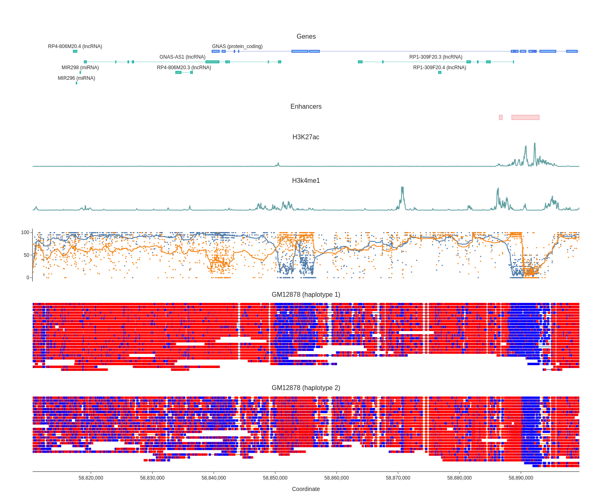

# modbamtools

[](https://pypi.org/project/modbamtools/)
[](https://github.com/rrazaghi/modbamtools/releases)
[](https://github.com/rrazaghi/modbamtools/actions?query=workflow%3ATest)
[](https://github.com/rrazaghi/modbamtools/blob/master/LICENSE)

A set of tools to manipulate and visualize data from base modification bam files

## Installation

Install this tool using `pip`:

    $ pip install modbamtools

## Usage

General commands:
```
Usage: modbamtools [OPTIONS] COMMAND [ARGS]...

  A set of tools to manipulate and visualize data from base modification bam files

Options:
  --version  Show the version and exit.
  --help     Show this message and exit.

Commands:
plot  This Command will plot single-read base modification data
```

Plotting command:
```
Usage: modbamtools plot [OPTIONS] BAMS...

  This Command will plot single-read base modification data

Options:
  -r, --region TEXT         Region of interest. example: chr21:1-1000
  -br, --batch PATH         makes html report for all regions in the bed file
  -g, --gtf PATH            makes gene tracks from sorted and tabix gtf files
  -b, --bed PATH            makes tracks from sorted and tabix bed files. This
                            will plot each interval as a rectangle (similar to
                            gtf)
  -bw, --bigwig PATH        makes a track from bigwig files
  -bd, --bedgraph PATH      makes a track from bigwig files
  -s, --samples TEXT        sample names per each bam input
  -tr, --track-titles TEXT  titles of tracks provided in order of gtf files,
                            bed files, bigwig files, bedgraph files
  -hp, --hap                reads will be grouped according to HP tag in bam
                            (comma separated)
  -st, --strands            reads will be grouped by strand in bam
  -o, --out PATH            output path for html plot  [required]
  -p, --prefix TEXT         File name for output
  -f, --fmt TEXT            format of output file (png, html, svg, pdf)
  -u, --can_prob FLOAT      probability threshold for canonical bases
  -m, --mod_prob FLOAT      probability threshold for modified bases
  -h, --height INTEGER      height of plot in px. This is for fine tuning, the
                            height is automatically calculated.
  -w, --width INTEGER       width of plot in px
  --help                    Show this message and exit.

example:  modbamtools plot -r $region --gtf $gtf -hp -b $bed -bw $bw1 -bw $bw2 --samples $names --track-titles $tracks -w 1500 --out $out --prefix $prefix --fmt png $bam
```



## Development

To contribute to this tool, first checkout the code. Then create a new virtual environment:

    cd modbamtools
    python -m venv venv
    source venv/bin/activate

Or if you are using `pipenv`:

    pipenv shell

Now install the dependencies and test dependencies:

    pip install -e '.[test]'

To run the tests:

    pytest
