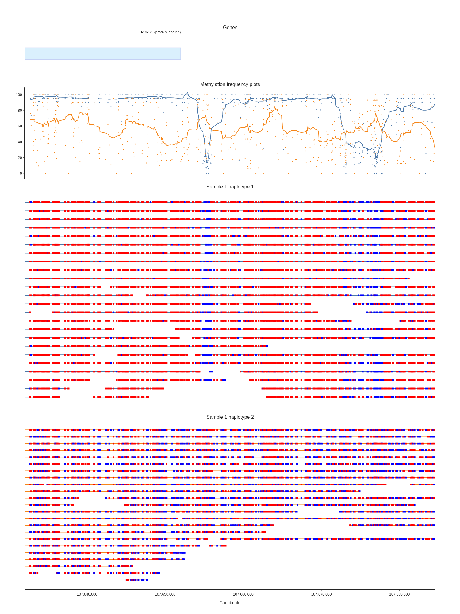

# modbamtools

[](https://pypi.org/project/modbamtools/)
[](https://github.com/rrazaghi/modbamtools/releases)
[](https://github.com/rrazaghi/modbamtools/actions?query=workflow%3ATest)
[](https://github.com/rrazaghi/modbamtools/blob/master/LICENSE)

A set of tools to manipulate and visualize data from base modification bam files

## Installation

Install this tool using `pip`:

    $ pip install modbamtools

## Usage

General commands:
```
Usage: modbamtools [OPTIONS] COMMAND [ARGS]...

  A set of tools to manipulate and visualize data from base modification bam files

Options:
  --version  Show the version and exit.
  --help     Show this message and exit.

Commands:
plot  This Command will plot single-read base modification data
```

Plotting command:
```
Usage: modbamtools plot [OPTIONS] BAMS...

  This Command will plot single-read base modification data

Options:
  -r, --region TEXT     region of interest (chr21:1-1000)  [required]
  -g, --gtf PATH        gtf file in .gz sorted and tabix  [required]
  -s, --samples TEXT    sample names per each bam input
  -hp, --hap            Reads will be grouped according to HP tag in bam
  -o, --out PATH        output path for html plot  [required]
  -p, --prefix TEXT     file name for output
  -f, --fmt TEXT        format of output file (png, html, svg, pdf)
  -u, --can_prob FLOAT  probability threshold for canonical bases
  -m, --mod_prob FLOAT  probability threshold for modified bases
  -h, --height INTEGER  height of plot in px
  -w, --width INTEGER   width of plot in px
  --help                Show this message and exit.

example: modbamtools plot -r chr22:29188081-29222181 -hp --gtf gencode.v38.annotation.sorted.gtf.gz --out ./plots modbam.bam -h 1000
```



## Development

To contribute to this tool, first checkout the code. Then create a new virtual environment:

    cd modbamtools
    python -m venv venv
    source venv/bin/activate

Or if you are using `pipenv`:

    pipenv shell

Now install the dependencies and test dependencies:

    pip install -e '.[test]'

To run the tests:

    pytest
